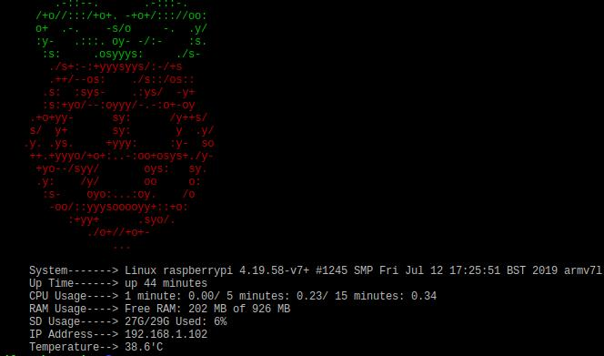

# RaspberryMOTD

A custom Message Of The Day for Raspberry

## Installation

- Copy and paste the content of **raspberrymotd.sh** in a file called **'01-customized'**
- Move the file to **/etc/update-motd.d/**
- Make the file executable: 
  - ` # chmod a+x /etc/update-motd.d/01-customized `
- That's it
